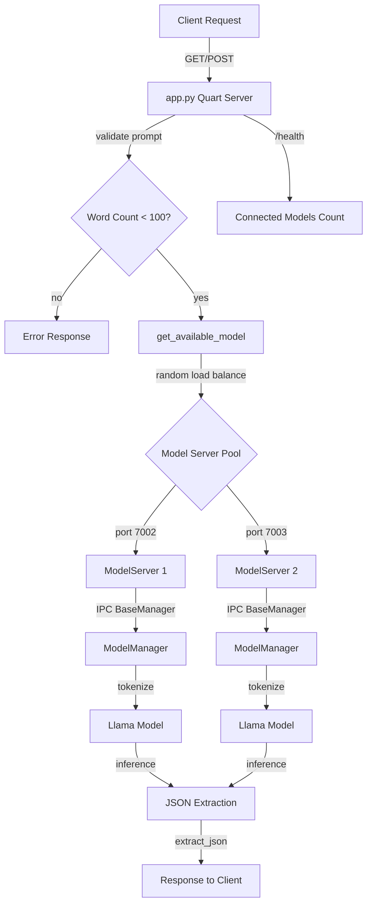

## Installation

```bash
git clone https://github.com/Circuit-Overtime/moeJson.git
cd moeJson

pip install -r requirements.txt
```

# Download model
```bash
chmod +x model_installation.sh
./model_installation.sh
```

## Running

### Start Model Servers

```bash
python api/model_server.py 7002
python api/model_server.py 7003
```

### Start API

```bash
python api/app.py
```

## Usage

```bash
curl "http://localhost:9000/gen?prompt=Generate%20image%20of%20sunset"

# POST request
curl -X POST http://localhost:9000/gen \
    -H "Content-Type: application/json" \
    -d '{"prompt": "Generate image of sunset"}'

curl http://localhost:9000/health
```

## Architecture


